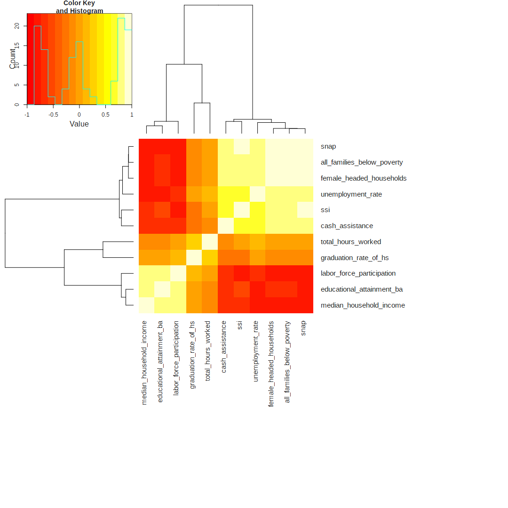
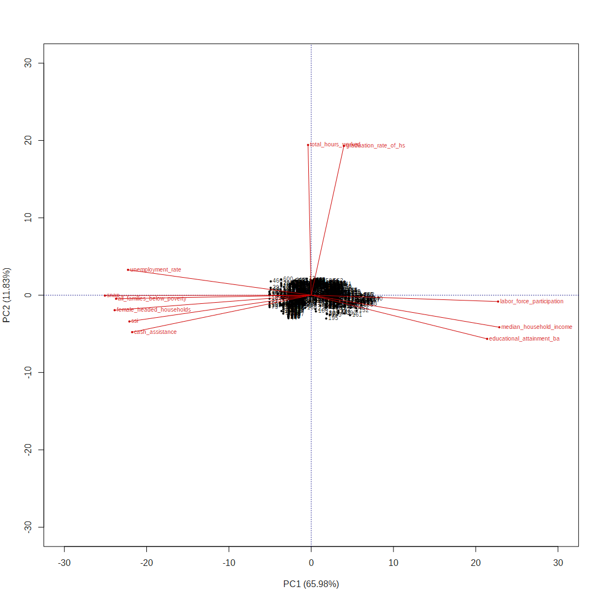
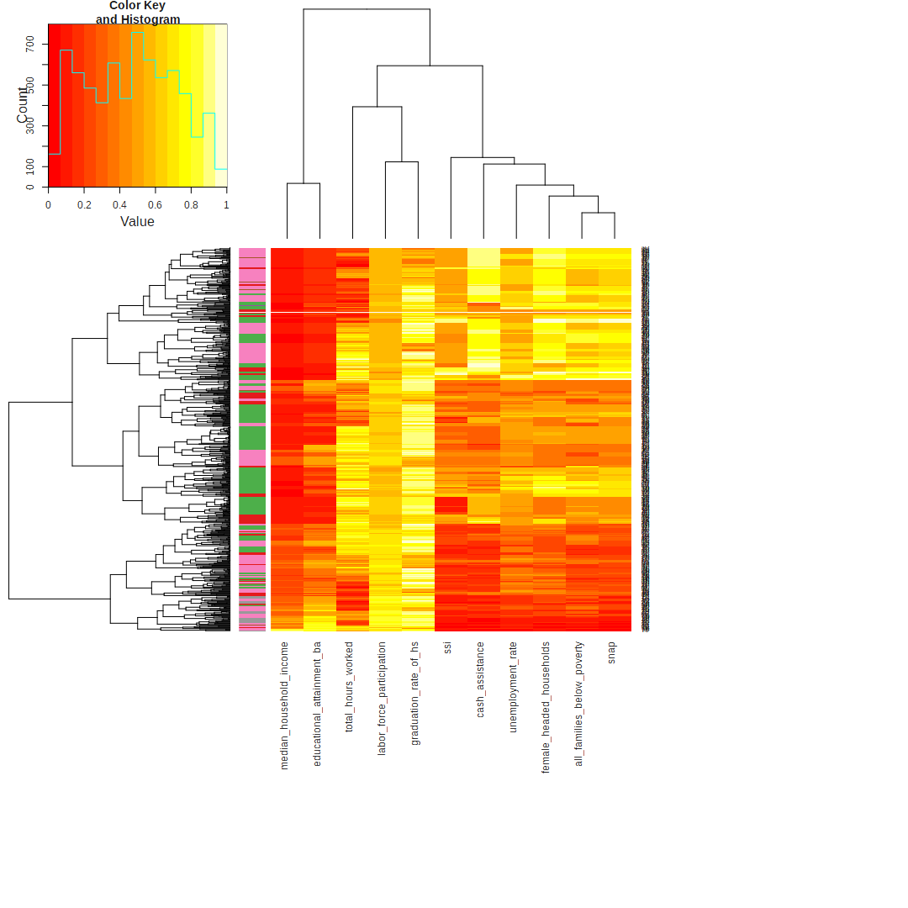

\#UrbanDataCamp: Using Data to Help Low-Income Youth Find Jobs

Overview
========

Questions
---------

1.  Can we show that job opportunities for less-privileged youths leads to good outcomes later in life? (College enrollment, etc.)

Notes
-----

### General

-   "Alumni"
-   "Terminated" - didn't finish

### Factors associated with a positive outcome:

-   college enrollment
-   college persistence
-   alumni

Methods
=======

Load data
---------

``` r
library(readr)
library(dplyr)

dat = read_csv('input/UA_UI_DataCamp_with_Codebook_4_29.csv')
```

    ## Warning: 2402 problems parsing
    ## 'input/UA_UI_DataCamp_with_Codebook_4_29.csv'. See problems(...) for more
    ## details.

``` r
# preview data
kable(dat[1:5, 1:6])
```

| DataCamp ID | Academic Year | Location                            | Intern Status | Intern Work Site                                               |  Work Site ZIP Code|
|:------------|:--------------|:------------------------------------|:--------------|:---------------------------------------------------------------|-------------------:|
| UADC1096    | 2014 - 2015   | DC - Year Round High School Program | Active        | Clark Construction Group, LLC Accounts Payable 2014-2015       |               20814|
| UADC1281    | 2014 - 2015   | NCR                                 | Active        | Patent and Trade Office NCR 2014-2015                          |               22314|
| UADC1129    | 2014 - 2015   | Baltimore - YAIP                    | Alumni        | ECSM BAL YAIP 2014-2015                                        |               21213|
| UADC1254    | 2014 - 2015   | DC - Year Round High School Program | Active        | Office of Personnel Management - Retirement Services 2014-2015 |               20240|
| UADC1007    | 2014 - 2015   | NCR                                 | Active        | Alexandria City Attorney's Office NCR 2014-2015                |               22314|

``` r
kable(dat[1:5, 7:12])
```

| Organization                             | Industry    | Total Hours Worked | DOB        |  Mailing ZIP/Postal Code|  Median Household Income|
|:-----------------------------------------|:------------|:------------------:|:-----------|------------------------:|------------------------:|
| Clark Construction Group, LLC            | Real Estate |         251        | 1996-02-21 |                    20019|                    34832|
| Patent and Trade Office                  | Government  |         162        | 1997-02-15 |                    22304|                    76061|
| Episcopal Community Services of Maryland | Non-profit  |         55         | 1993-11-15 |                    21215|                    34471|
| Office of Personnel Management           | Government  |         129        | 1997-10-18 |                    20020|                    34685|
| Alexandria City Attorney's Office        | Government  |         103        | 1997-06-11 |                    22312|                    76845|

``` r
kable(dat[1:5, 13:19])
```

|  Labor Force Participation|  Unemployment Rate|    SSI|  Cash Assistance|   SNAP|  All Families Below Poverty|  Educational Attainment - BA or Higher|
|--------------------------:|------------------:|------:|----------------:|------:|---------------------------:|--------------------------------------:|
|                      0.595|              0.136|  0.115|            0.103|  0.324|                       0.264|                                  0.134|
|                      0.788|              0.045|  0.022|            0.017|  0.048|                       0.046|                                  0.586|
|                      0.555|              0.102|  0.123|            0.064|  0.268|                       0.223|                                  0.171|
|                      0.561|              0.115|  0.113|            0.124|  0.348|                       0.317|                                  0.160|
|                      0.757|              0.037|  0.013|            0.016|  0.056|                       0.091|                                  0.435|

``` r
kable(dat[1:5, 20:26])
```

|  Female-Headed Households| Race            | Gender | High School                                                                 |  Title I School?|  FRL  |  Graduation Rate of HS|
|-------------------------:|:----------------|:-------|:----------------------------------------------------------------------------|----------------:|:-----:|----------------------:|
|                     0.188| Black           | F      | Washington Mathematics Science Technology Public Charter High School (WMST) |                1| 1.000 |                  0.910|
|                     0.049| Hispanic/Latino | F      | TC Williams                                                                 |                0| 0.630 |                  0.843|
|                     0.118| Black           | F      |                                                                             |               NA|   NA  |                     NA|
|                     0.203| Black           | M      | Ballou Senior High School                                                   |                1| 0.998 |                  0.500|
|                     0.044| Black           | F      | TC Williams                                                                 |                0| 0.630 |                  0.843|

``` r
kable(dat[1:5, 26:33])
```

|  Graduation Rate of HS|  College Enrollment Rate of HS|  HS ZIP Code|  NSC Data Available?| 1st Year College Enrollment | 1st Year College Type (2/4) | 1st Year College State | Student Quote |
|----------------------:|------------------------------:|------------:|--------------------:|:----------------------------|:----------------------------|:-----------------------|:--------------|
|                  0.910|                             NA|        20002|                    0| NA                          | NA                          | NA                     |               |
|                  0.843|                             NA|        22302|                    0| NA                          | NA                          | NA                     |               |
|                     NA|                             NA|           NA|                    0| NA                          | NA                          | NA                     |               |
|                  0.500|                             NA|        20032|                    0| NA                          | NA                          | NA                     |               |
|                  0.843|                             NA|        22302|                    0| NA                          | NA                          | NA                     |               |

### Variables

Note: Formatting for metadata is a little bit messed up...

``` r
metadata = read_csv('input/UA_UI_DataCamp_with_Codebook_4_29_metadata.csv')
kable(metadata)
```

| Column Heading                           | Description                                                                                                                                                          |
|:-----------------------------------------|:---------------------------------------------------------------------------------------------------------------------------------------------------------------------|
| DataCamp ID                              | Unique intern identifier                                                                                                                                             |
| Academic Year                            | Program year of participation                                                                                                                                        |
| Location                                 | Urban Alliance program/region                                                                                                                                        |
| Intern Status                            | Active: Intern is currently in program                                                                                                                               |
| Alumni: Intern successfully completed pr | ogram.                                                                                                                                                               |
| Summer Program Alumni: Intern successful | ly completed the program and will likely return in the fall (Rising HS seniors)                                                                                      |
| Terminated: Dropped out of the program d | ue to performance reasons or self-removal                                                                                                                            |
| Intern Work Site                         | Tag for where interns worked, comprised of organization name, location, and academic year                                                                            |
| Work Site ZIP Code                       | ZIP Code of Intern Work Site                                                                                                                                         |
| Organization                             | Work Site Organization Name                                                                                                                                          |
| Industry                                 | Specific industry organization falls into                                                                                                                            |
| Total Hours Worked                       | Sum of monthly hours interns worked during the program; compiled from ADP payroll reports                                                                            |
| DOB                                      | Intern date of birth                                                                                                                                                 |
| Mailing ZIP/Postal Code                  | Intern's home ZIP Code                                                                                                                                               |
| Median Household Income                  | ZIP Code-based; Median household income of residents within intern's home ZIP code; ACS 2013 5-year estimates                                                        |
| Labor Force Participation                | ZIP Code-based; Labor force participation rate of residents within intern's home ZIP code; ACS 2013 5-year estimates                                                 |
| Unemployment Rate                        | ZIP Code-based; Unemployment rate of residents within intern's home ZIP code; ACS 2013 5-year estimates                                                              |
| SSI                                      | ZIP Code-based; Percent of residents receiving SSI within intern's home ZIP code; ACS 2013 5-year estimates                                                          |
| Cash Assistance                          | ZIP Code-based; Percent of residents receiving cash assistance within intern's home ZIP code; ACS 2013 5-year estimates                                              |
| SNAP                                     | ZIP Code-based; Percent of residents receiving SNAP benefits within intern's home ZIP code; ACS 2013 5-year estimates                                                |
| All Families Below Poverty               | ZIP Code-based; Percent of residents living below poverty within intern's home ZIP code; ACS 2013 5-year estimates                                                   |
| Educational Attainment - BA or Higher    | ZIP Code-based; Percent of residents with a Bachelor's degree or higher within intern's home ZIP code; ACS 2013 5-year estimates                                     |
| Female-Headed Households                 | ZIP Code-based; Percent of residents living in female-headed households with children under 18 years of age within intern's home ZIP code; ACS 2013 5-year estimates |
| Race                                     | Intern race (self-identified, voluntary)                                                                                                                             |
| Gender                                   | Intern gender (self-identified, voluntary)                                                                                                                           |
| High School                              | High School intern attended                                                                                                                                          |
| Title I School?                          | School-based                                                                                                                                                         |
| 1: High School receives Title I funding  |                                                                                                                                                                      |
| 0: High School does not receive Title I  | funding                                                                                                                                                              |
| blank: Title I data not found            |                                                                                                                                                                      |
| FRL                                      | School-based; Percent of students in high school qualified for free or reduced lunch                                                                                 |
| Graduation Rate of HS                    | School-based; Percent of high school students graduating within four years                                                                                           |
| College Enrollment Rate of HS            | School-based; Percent of high school students who enroll in college following graudation                                                                             |
| HS ZIP Code                              | ZIP Code of High School                                                                                                                                              |
| NSC Data Available?                      | 1: Alum has been included in a National Student Clearinghouse data request to determine college enrollment                                                           |
| 0: Alum has not been included in a Natio | nal Student Clearinghouse data request to determine college enrollment                                                                                               |
| 1st Year College Enrollment              | Enrolled: Alum was enrolled in college at time of National Student Clearinghouse data pull                                                                           |
| Unenrolled: Alum was not enrolled at tim | e of National Student Clearinghouse data pull                                                                                                                        |
| 1st Year College Type (2/4)              | 2: Two-year college                                                                                                                                                  |
| 4: Four-year college                     |                                                                                                                                                                      |
| No record found: Alum did not have a Nat | ional Student Clearinghouse record                                                                                                                                   |
| 1st Year College State                   | State in which college is located                                                                                                                                    |
| Student Quote                            | Open-ended response from intern post-program survey                                                                                                                  |

``` r
# convert dates to factors so they aren't treated as numeric
dat[['Work Site ZIP Code']]      = factor(dat[['Work Site ZIP Code']])
dat[['Mailing ZIP/Postal Code']] = factor(dat[['Mailing ZIP/Postal Code']])
dat[['HS ZIP Code']]             = factor(dat[['HS ZIP Code']])
```

``` r
table(dat[['Intern Status']])
```

    ## 
    ##                                 Active 
    ##                                    355 
    ##                                 Alumni 
    ##                                    744 
    ##                  Summer Program Alumni 
    ##                                     42 
    ##                     Terminated Student 
    ##                                     29 
    ## Terminated Student - Performance Based 
    ##                                    109 
    ##      Terminated Student - Self Removed 
    ##                                    117

### Rename variables

For easier typing...

``` r
colnames(dat) = c('datacamp_id', 'academic_year', 'location', 'intern_status',
                  'intern_work_site', 'work_site_zip', 'organization', 'industry',
                  'total_hours_worked', 'dob', 'mailing_zip',
                  'median_household_income', 'labor_force_participation',
                  'unemployment_rate', 'ssi', 'cash_assistance', 'snap',
                  'all_families_below_poverty', 'educational_attainment_ba',
                  'female_headed_households', 'race', 'gender', 'high_school',
                  'title_i_school', 'frl', 'graduation_rate_of_hs',
                  'college_enrollment_of_hs', 'hs_zip_code', 'nsc_data_available',
                  'first_year_college_enrollment', 'first_year_college_type',
                  'first_year_college_state', 'student_quote')

# save with alternative name
write_csv(dat, 'input/UA_UI_DataCamp_with_Codebook_4_29_clean.csv')
```

### Exploratory data analysis

#### Variable relationships

``` r
library(gplots)
library(bpca)
library(RColorBrewer)

dat_short = dat %>% select(intern_status, total_hours_worked,
                           median_household_income,
                           labor_force_participation, unemployment_rate,
                           ssi, cash_assistance, snap,
                           all_families_below_poverty,
                           educational_attainment_ba, female_headed_households,
                           graduation_rate_of_hs)

dat_short_complete = dat_short[complete.cases(dat_short),]
heatmap.2(cor(as.matrix(dat_short_complete %>% select(-intern_status))),
          margins=c(26, 26), trace='none')
```



``` r
# group by location
location_colors = brewer.pal(length(unique(dat$location)), "Set1")[
    as.numeric(as.factor((as.character(dat$location))))]
names(location_colors) = dat$location

location_colors_complete = location_colors[complete.cases(dat_short)]

# biplot
plot(bpca(dat_short_complete %>% select(-intern_status),
          var.color=location_colors_complete, scale=TRUE))
```



#### Students

``` r
# rescale data
rescale = function(x) {
    (x - min(x)) / max(x)
}

dat_short_complete$median_household_income = rescale(dat_short_complete$median_household_income)
dat_short_complete$total_hours_worked      = log1p(dat_short_complete$total_hours_worked)


# numeric fields only
#mat = dat_short_complete %>% select(-intern_status)
#mat_scaled = scale(dat_short_complete)
heatmap.2(as.matrix(dat_short_complete %>% select(-intern_status)),
          margins=c(26, 26), trace='none',
          RowSideColors=location_colors_complete)
```


